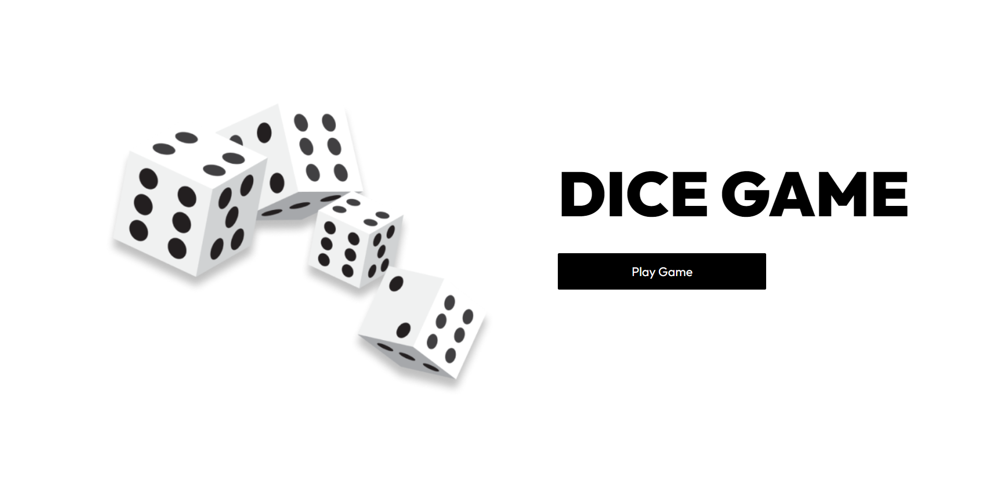
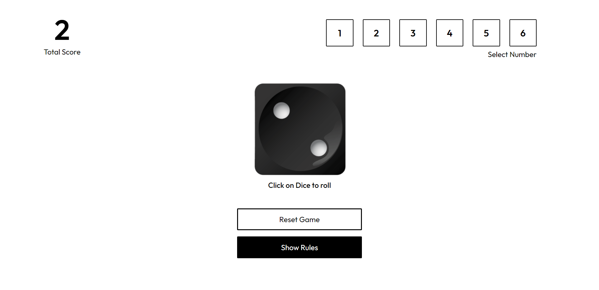
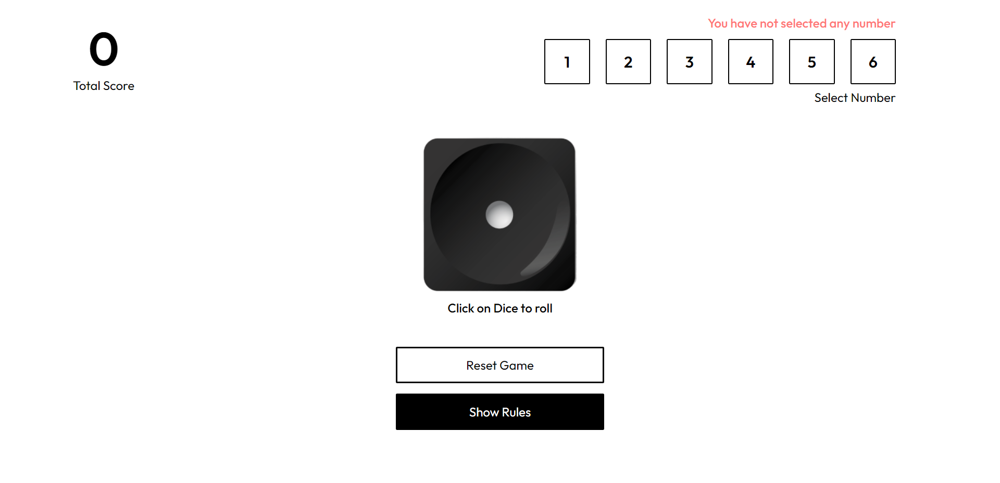
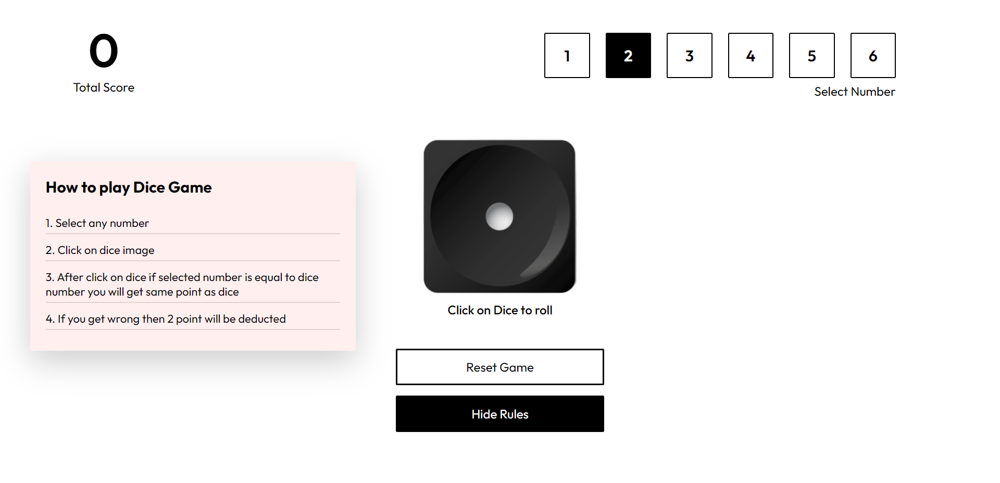

# React Dice Game

Welcome to the React Dice Game repository! This project is a React-based web application that implements a dice game. It utilizes React's state management (useState), components, and styled components to create a modern and interactive user interface.

## Preview

### 1. Home Page


### 2. Score Tracking


### 3. It will show error when you do not choose any number


### 4. You can see rules how to play


## Features

- **Dice Game:** Play a fun and interactive dice game.
- **Score Tracking:** Increase your score by rolling the dice.
- **Rules Display:** View the rules of the game for guidance.
- **Modern UI Design:** Utilizes styled components for a sleek and visually appealing layout.

## Getting Started

To run the React Dice Game locally, follow these steps:

1. Clone the repository to your local machine:

   ```bash
   git clone https://github.com/Devsethi3/React-Dice-Game.git
   ```

2. Navigate to the project directory:

   ```bash
   cd React-Dice-Game
   ```

3. Install dependencies:

   ```bash
   npm install
   ```

4. Start the development server:

   ```bash
   npm start
   ```

5. Open your browser and visit [http://localhost:3000](http://localhost:3000) to view the app.

## Usage

1. Roll the dice to increase your score.
2. Click on "Show Rules" to view the rules of the game.

## Customization

Feel free to customize this React Dice Game to fit your preferences. Explore the components, styles, and functionality in the source code and make changes accordingly.

## Contributing

If you'd like to contribute to this project, please follow these steps:

1. Fork the repository.
2. Create a new branch for your feature or improvement.
3. Make your changes and commit them with descriptive messages.
4. Push your changes to your forked repository.
5. Open a pull request to merge your changes into the main branch.

Explore the React Dice Game, have fun playing, and consider contributing to its development. Thank you for checking out the repository!